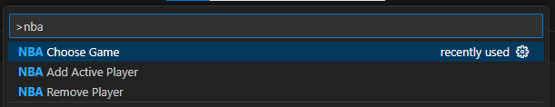

# NBALive README

**NBALive** lets you keep track of the NBA Action right in the **VS Code Explorer**, without leaving your coding flow.

## Installation
Navigate to the VScode Store and search NBA Live

## Features

- 🔍 **Player Stats**  
    Search for your favourite players and keep track of their stats

- 🏀 **Taskbar integration**  
    Browse through all availiable games in the taskbar

## Commands
Find all the commands by hitting ctrl shift p on windows / cmd shift p on mac and typing NBA

## Release Notes

### 1.0.0

Initial release of NBA Live! Thank you for the support, background templates will be coming soon!

<!-- 
* [Extension Guidelines](https://code.visualstudio.com/api/references/extension-guidelines)

## Working with Markdown

You can author your README using Visual Studio Code. Here are some useful editor keyboard shortcuts:

* Split the editor (`Cmd+\` on macOS or `Ctrl+\` on Windows and Linux).
* Toggle preview (`Shift+Cmd+V` on macOS or `Shift+Ctrl+V` on Windows and Linux).
* Press `Ctrl+Space` (Windows, Linux, macOS) to see a list of Markdown snippets.

## For more information

* [Visual Studio Code's Markdown Support](http://code.visualstudio.com/docs/languages/markdown)
* [Markdown Syntax Reference](https://help.github.com/articles/markdown-basics/)

**Enjoy!** -->
